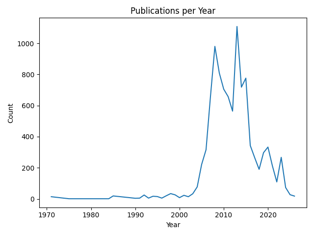
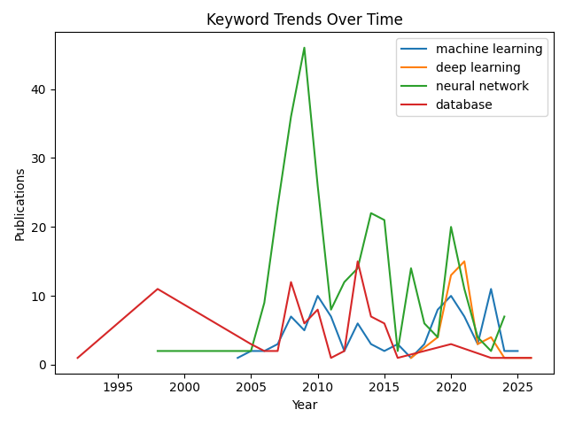

# DBLP Dataset Analysis — ML/AI Summer Trainee Recruitment Task

An end-to-end analysis of the [DBLP](https://dblp.org/) computer science bibliography dataset, covering exploratory data analysis, keyword trend tracking, and a RAG-based semantic search system.

---

## Project Structure

```
.
├── prepare_data.py   # XML parsing and CSV export
├── analyze.py        # Keyword trends
├── rag.py            # RAG pipeline for semantic document search
├── sample.xml        # XML subset used by the RAG pipeline
├── dblp_sample.csv   # Preprocessed CSV exported by prepare_data.py
└── README.md
```

---

## Dataset

The official DBLP dataset was used. The dataset is provided as a large XML file (`dblp.xml`).

**Subset used:** Due to the size of the full dataset, the scripts default to processing the first **10,000 records** for the CSV pipeline and **10,000 records** for structural analysis. The limit can be adjusted via the `limit` parameter in `prepare_data.py`.

A smaller `sample.xml` subset is used by the RAG pipeline for embedding and retrieval. It was created by taking the first 10,000 lines of the full XML file:

```bash
head -n 10000 dblp.xml > sample.xml
```

---

## Setup

### Requirements

Install dependencies with pip:

```bash
pip install pandas matplotlib networkx lxml langchain langchain-community \
    langchain-huggingface langchain-chroma langchain-nvidia-ai-endpoints \
    chromadb sentence-transformers python-dotenv
```

### Environment Variables

Create a `.env` file in the project root:

```
nvidia=<YOUR_NVIDIA_API_KEY>
```

The RAG pipeline uses the [NVIDIA AI Endpoints](https://docs.api.nvidia.com/) to access `openai/gpt-oss-120b`.

---

## Usage

### 1. Prepare the Data

Parse the raw DBLP XML file and export a structured CSV:

```bash
python prepare_data.py
```

This will:
- Analyse the XML structure (record types and field names) for the first 10,000 records.
- Parse up to 10,000 records and export them to `dblp_sample.csv` with columns: `type`, `title`, `year`, `authors`, `booktitle`, `pages`.

### 2. Run Exploratory Data Analysis

```bash
python analyze.py
```

This produces:
- **Publications per year** — line chart of publication volume over time.
- **Top venues** — the 10 most frequent conference/journal venues (`booktitle`).
- **Top authors** — the 10 most prolific authors by publication count.
- **Collaboration graph** — a co-authorship network built from the first 10,000 records, with stats on node/edge counts and top collaborators by degree.
- **Keyword trends** — publication counts over time for `machine learning`, `deep learning`, `neural network`, and `database`.

### 3. Run the RAG Pipeline

```bash
python rag.py
```

This will:
- Load the `sample.xml` file and split it into overlapping chunks.
- Embed all chunks using `sentence-transformers/all-MiniLM-L6-v2`.
- Store embeddings in a local [Chroma](https://www.trychroma.com/) vector store.
- Retrieve the 15 most relevant chunks for the query and pass them to the LLM.
- Print the answer to: *"Which documents are related to ML/AI."*

The query can be changed directly in `rag.py`.

---

## Conclusions & Insights

### Data Structure (`prepare_data.py`)

The first 10,000 records of `dblp.xml` break down by type as follows:

| Record type | Count |
|---|---|
| `incollection` | 8,649 |
| `book` | 1,274 |
| `inproceedings` | 57 |
| `proceedings` | 14 |
| `mastersthesis` | 6 |

The sample is dominated by `incollection` entries (book chapters), which is typical of the portion of DBLP that indexes edited volumes. The most common fields are `author` (25,618 occurrences), `ee`, `title`, `year`, `pages`, `url`, and `booktitle`, confirming that publication metadata is well-populated for the majority of records.

### Publications per Year (`analyze.py`)



Publication volume is negligible before 1990, then rises steadily through the 1990s. A dramatic spike occurs around **2008–2013**, reaching over 1,000 publications per year, followed by a drop. This pattern reflects the composition of the subset rather than the full DBLP corpus, and serves as a useful reminder that the choice of subset affects aggregate trends.

### Top Venues

The most frequent venues in the sample are edited book series rather than traditional conference proceedings, e.g.:

1. *Ausgezeichnete Informatikdissertationen* — 179 entries
2. *The Effect of Information Technology on Business and Marketing Intelligence Systems* — 139
3. *Computer and Information Science* — 84

This is consistent with the dominance of `incollection` record types noted above.

### Top Authors & Collaboration Graph

The most prolific author in the sample is **Oscar Castillo** (180 publications), followed by **Patricia Melin** (147) and **Songsak Sriboonchitta** (95). These authors are predominantly affiliated with fuzzy systems, intelligent systems, and econometrics research groups.

The co-authorship graph built from the sample contains **16,209 nodes** and **30,209 edges**. Top collaborators by count:

| Author | Count |
|---|---|
| Muhammad Alshurideh | 137 |
| Oscar Castillo | 124 |
| Patricia Melin | 102 |
| Muhammad Turki Alshurideh | 99 |
| Haitham M. Alzoubi | 81 |

The high-degree nodes form dense clusters around a few prolific research groups, consistent with the scale-free structure typical of academic co-authorship networks.

### Keyword Trends



- **Neural network** dominates in this sample, with a sharp peak around **2008–2010** (~47 publications) and a secondary rise around 2013–2015. This reflects the heavy presence of intelligent/hybrid systems volumes in the subset.
- **Machine learning** and **deep learning** remain relatively low throughout, only picking up noticeably after 2020, consistent with the global research trend but muted here due to the subset composition.
- **Database** peaks around 1995-2000, 2007-2010 and 2012-2015, then steadily declines, reflecting the maturation of that research area.

### RAG Pipeline (`rag.py`)

Querying the vector store with *"Which documents are related to ML/AI"* identified **11 relevant documents** from the sample, including:

- *"The Psychology of Artificial Superintelligence"* — directly AI-focused.
- *"Critical Success Factors for Data Mining Projects"* — data mining as a core ML sub-field.
- *"Human-Computer Interaction and Augmented Intelligence – The Paradigm of Interactive Machine Learning in Educational Software"* — explicitly mentions machine learning.
- *"Artificial Intelligence Methods And Tools For Systems Biology"* — clearly AI.
- Multiple entries from the *Studies in Classification, Data Analysis, and Knowledge Organization* series — classification and data analysis being central ML topics.

The RAG approach successfully surfaces semantically relevant records without requiring exact keyword matches, demonstrating its value for open-ended exploration of a large bibliographic corpus.
